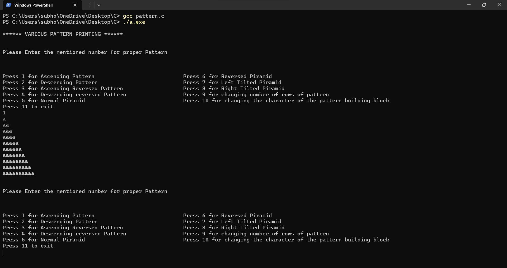

# Simple-Patterns-With-C-Programming-Demo-
Author: Subho Paul
 
Here is the demo of some patterns, that how the logic is built upon.
 
For using the code and to visualise patterns a c-compailer must be needed.

